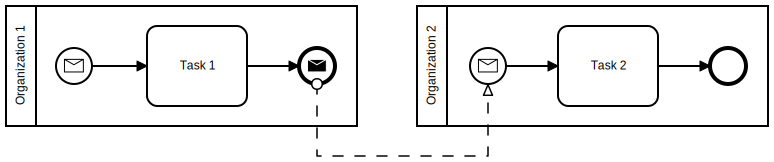

# Exercise 3 - Message Events
Communication between organizations is modeled using message flow in BPMN processes. The third exercise shows how a process at one organization can trigger a process at another organization.

To demonstrate communication between two organizations we will configure message flow between the processes `highmedorg_helloDic` and `highmedorg_helloCos`. The processes are then to be executed at the organization `Test_DIC` and `Test_COS` respectively in the docker test setup, with the former triggering the latter.

## Introduction
### Message Flow and FHIR Task resources
BPMN processes are instantiated and started within DSF by creating a matching FHIR [Task](http://hl7.org/fhir/R4/task.html) resource in the DSF FHIR server. This is true for executing a process on the local DSF BPE server as well as creating and starting a process instance at a remote DSF BPE server.

In order to exchange information between different processes, for example at two different organizations, BPMN message flow is used. Typically represented by a dashed line between elements with black (send) and white (receive) envelop icons. The following BPMN collaboration diagram shows two processes, with the process at "Organization 1" sending a message to "Organization 2" which results in the instantiation and execution of new process instance at the second organization.



Every time message flow is used in a BPMN process for the DSF, a corresponding FHIR [Task](http://hl7.org/fhir/R4/task.html) profile needs to be specified for every interaction. This profile specifies which process should be started or continued and what the message name is when correlating the appropriate [Message Start Event](https://docs.camunda.org/manual/7.17/reference/bpmn20/events/message-events/#message-start-event) or [Intermediate Message Catch Event](https://docs.camunda.org/manual/7.17/reference/bpmn20/events/message-events/#message-intermediate-catching-event). If necessary a _Business Key_ and a _Correlation Key_ are specified if different process instances need to be linked to a single execution. For example to be able to send a message back.

### BPMN Process Definition Key vs. FHIR Task.instantiatesUri and ActivityDefinition.url / version
FHIR [ActivityDefinition](http://hl7.org/fhir/R4/activitydefinition.html) resources are used to announce what processes can be instantiated at a given DSF instance. They also control what kind of organization can request the instantiation or continuation of a process instance and what kind of organization is allowed to fulfill the request.

In order to link the FHIR and BPMN worlds the BPMN process definition key needs to be specified following the pattern `^[-a-zA-Z0-9]+_[-a-zA-Z0-9]+$` for example:  
```
domainorg_processKey
```
In addition the BPM process needs to specify a process version with the pattern `^\d+.\d+.\d+$` for example:
```
1.0.0
```

This results in a canonical URL used to identify the process, for example:
```
http://domain.org/bpe/Process/processKey/1.0.0
```

The canonical URL is used for [Task.instantiatesUri](http://hl7.org/fhir/R4/task.html) and [ActivityDefinition.url / version](http://hl7.org/fhir/R4/activitydefinition.html).

## Exercise Tasks
1. Modify the `highmedorg_helloDic` process in the `hello-dic.bpmn` file and replace the [End Event](https://docs.camunda.org/manual/7.17/reference/bpmn20/events/none-events/#none-end-event) with a [Message End Event](https://docs.camunda.org/manual/7.17/reference/bpmn20/events/message-events/#message-end-event). Configure input parameters `instantiatesUri`, `profile` and `messageName` in the BPMN model for the [Message End Event](https://docs.camunda.org/manual/7.17/reference/bpmn20/events/message-events/#message-end-event). Set the message name of the [Message End Event](https://docs.camunda.org/manual/7.17/reference/bpmn20/events/message-events/#message-end-event) and configure it to be execute using the `HelloCosMessage` class.  
    Use `http://highmed.org/fhir/StructureDefinition/task-hello-cos|#{version}` as the profile and `helloCos` as the message name. Figure out what the appropriate `instantiatesUri` value is, based on the name (process definition key) of the process to be triggered.
1. Modify the `highmedorg_helloCos` proces in the `hello-cos.bpmn` file and configure the message name of the [Message Start Event](https://docs.camunda.org/manual/7.17/reference/bpmn20/events/message-events/#message-start-event) with the same value as the message name of the [Message End Event](https://docs.camunda.org/manual/7.17/reference/bpmn20/events/message-events/#message-end-event) in the `highmedorg_helloDic` process. 
1. Create a new [StructureDefinition](http://hl7.org/fhir/R4/structuredefinition.html) with a [Task](http://hl7.org/fhir/R4/task.html) profile for the `helloCos` message.
1. Create a new [ActivityDefinition](http://hl7.org/fhir/R4/activitydefinition.html) resource for the `highmedorg_helloCos` process and configure the authorization extension to allow the `Test_DIC` organization as the requester and the `Test_COS` organization as the recipient.
1. Add the `highmedorg_helloCos` process and its resources to the `TutorialProcessPluginDefinition` class.
1. Modify `HelloDic` service class to set the `target` process variable for the `Test_COS` organization.
1. Configure the `HelloCosMessage` class as a spring in the `TutorialConfig` class.

## Solution Verification
### Maven Build and Automated Tests
Execute a maven build of the `dsf-process-tutorial` parent module via:
```
mvn clean install -Pexercise-3
```
Verify that the build was successful and no test failures occurred.

### Process Execution and Manual Tests
To verify the `highmedorg_helloDic` and `highmedorg_helloCos` processes can be executed successfully, we need to deploy them into DSF instances and execute the `highmedorg_helloDic` process. The maven `install` build is configured to create a process jar file with all necessary resources and copy the jar to the appropriate locations of the docker test setup.

1. Start the DSF FHIR server for the `Test_DIC` organization in a console at location `.../dsf-process-tutorial/test-setup`:
   ```
   docker-compose up dic-fhir
   ```
   Verify the DSF FHIR server started successfully.

2. Start the DSF BPE server for the `Test_DIC` organization in another console at location `.../dsf-process-tutorial/test-setup`:
   ```
   docker-compose up dic-bpe
   ```
   Verify the DSF BPE server started successfully and deployed the `highmedorg_helloDic` process.

3. Start the DSF FHIR server for the `Test_COS` organization in a console at location `.../dsf-process-tutorial/test-setup`:
   ```
   docker-compose up cos-fhir
   ```
   Verify the DSF FHIR server started successfully. You can access the webservice of the DSF FHIR server at https://cos/fhir  
   The DSF FHIR server uses a server certificate that was generated during the first maven build. To authenticate yourself to the server you can use the client certificate located at `.../dsf-process-tutorial/test-data-generator/cert/Webbrowser_Test_User/Webbrowser_Test_User_certificate.p12` (Password: password)

4. Start the DSF BPE server for the `Test_COS` organization in another console at location `.../dsf-process-tutorial/test-setup`:
   ```
   docker-compose up cos-bpe
   ```
   Verify the DSF BPE server started successfully and deployed the `highmedorg_helloCos` process. The DSF BPE server should print a message that the process was deployed. The DSF FHIR server should now have a new ActivityDefinition resource. Go to https://cos/fhir/ActivityDefinition to check if the expected resource was created by the BPE while deploying the process. The returned FHIR Bundle should contain a two ActivityDefinition resources. Also, go to https://cos/fhir/StructureDefinition?url=http://highmed.org/fhir/StructureDefinition/task-hello-cos to check if the expected [Task](http://hl7.org/fhir/R4/task.html) profile was created.

5. Start the `highmedorg_helloDic` process by posting a specific FHIR [Task](http://hl7.org/fhir/R4/task.html) resource to the DSF FHIR server of the `Test_DIC` organization:
   Executing the `main` method of the `org.highmed.dsf.process.tutorial.TutorialExampleStarter` class to create the [Task](http://hl7.org/fhir/R4/task.html) resource needed to start the `highmedorg_helloDic` process.

   Verify that the FHIR [Task](http://hl7.org/fhir/R4/task.html) resource was created at the DSF FHIR server and the `highmedorg_helloDic` process was executed by the DSF BPE server of the `Test_DIC` organization. The DSF BPE server of the `Test_DIC` organization should print a message showing that a [Task](http://hl7.org/fhir/R4/task.html) resource to start the `highmedorg_helloCos` process was send to the `Test_COS` organization.  
   Verify that a FHIR [Task](http://hl7.org/fhir/R4/task.html) resource was created at the DSF FHIR server of the `Test_COS` organization and the `highmedorg_helloCos` process was then executed by the DSF BPE server of the `Test_COS` organization.