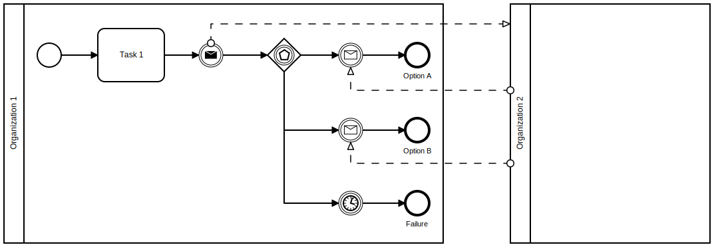

[Prerequisites](prerequisites.md) • [Exercise 1](exercise-1.md) • [Exercise 1.1](exercise-1-1.md) • [Exercise 2](exercise-2.md) • [Exercise 3](exercise-3.md) • [Exercise 4](exercise-4.md) • **Exercise 5**
___

# Exercise 5 - Event Gateway and Intermediate Events
In the final exercise we look at message flow between three organizations as well as continuing a process if no return message arrives.

## Introduction
### Managing Multiple- and Missing Messages
If an existing and started process instance is waiting for a message from another organization, the corresponding FHIR [Task](http://hl7.org/fhir/R4/task.html) may never arrive. Either because the other organization decides to never send the "message" or because some technical problem prohibits the [Task](http://hl7.org/fhir/R4/task.html) resource from being posted to the DSF FHIR server. This would result in stale process instances that never finish.

In order to solve this problem we can add an [Event Based Gateway](https://docs.camunda.org/manual/7.17/reference/bpmn20/gateways/event-based-gateway/) to the process waiting for a response and then either handle a [Task](http://hl7.org/fhir/R4/task.html) resource with the response and finish the process in a success state or fire of an [Intermediate Timer Catch Event](https://docs.camunda.org/manual/7.17/reference/bpmn20/events/timer-events/#timer-intermediate-catching-event) after a defined wait period and finish the process in an error state. The following BPMN collaboration diagram shows how the process at the first organization would look like if two different message or no message could be received:

<picture>
  <source media="(prefers-color-scheme: dark)" srcset="figures/exercise5_event_based_gateway_inverted.svg">
  <source media="(prefers-color-scheme: light)" srcset="figures/exercise5_event_based_gateway.svg">
  
</picture>

#### Timer Events
For [Timer Events](https://docs.camunda.org/manual/7.17/reference/bpmn20/events/timer-events/) the duration until the timer fires is specified using the [ISO 8601 Durations](http://en.wikipedia.org/wiki/ISO_8601#Durations) format. Examples can be found in the [Camunda 7 documentation](https://docs.camunda.org/manual/7.17/reference/bpmn20/events/timer-events/#time-duration).

### Matching Process Instances With Business Keys
In the example above the first organization is sending a "message" to the second and waiting for a reply. In order to correlate the return message with the waiting process instance, a unique identifier needs to be exchanged between both process instances. Within the DSF this is implemented using the process instance _business-key_ and a corresponding [Task.input](http://hl7.org/fhir/R4/task.html) parameter. For **1:1** communication relationships this is handled by the DSF BPE servers automatically, but the corresponding [Task](http://hl7.org/fhir/R4/task.html) profiles need to define the _business-key_ input parameter as mandatory.

If multiple message are send in a **1:n** relationship with a **n:1** return an additional _correlation-key_ needs to be configured in order to correlate every bidirectional communication between two DSF instances.

### ActivityDefinitions for the DSF
FHIR [ActivityDefinition](http://hl7.org/fhir/R4/activitydefinition.html) resources are used to announce what processes can be instantiated at a given DSF instance and contain the authorization rules for the specified process. [ActivityDefinition](http://hl7.org/fhir/R4/activitydefinition.html) for the DSF need to comply with the [http://highmed.org/fhir/StructureDefinition/activity-definition](https://github.com/highmed/highmed-dsf/blob/main/dsf-fhir/dsf-fhir-validation/src/main/resources/fhir/StructureDefinition/highmed-activity-definition-0.5.0.xml) profile, with authorization rules configured using the [http://highmed.org/fhir/StructureDefinition/extension-process-authorization](https://github.com/highmed/highmed-dsf/blob/main/dsf-fhir/dsf-fhir-validation/src/main/resources/fhir/StructureDefinition/highmed-extension-process-authorization-0.5.0.xml) extension.

The authorization extension needs to be configured at least once and has four sub extensions:
#### message-name [1..1]
String value specifying the message name of [Message Start Event](https://docs.camunda.org/manual/7.17/reference/bpmn20/events/message-events/#message-start-event), [Intermediate Message Catch Event](https://docs.camunda.org/manual/7.17/reference/bpmn20/events/message-events/#message-intermediate-catching-event) or [Message Receive Task](https://docs.camunda.org/manual/7.17/reference/bpmn20/tasks/receive-task/) this authorization rule should match. Can only be specified once per authorization rule extension.

#### task-profile [1..1]
Canonical URL value specifying the [Task](http://hl7.org/fhir/R4/task.html) profile this authorization rule should match. Can only be specified once per authorization rule extension.

#### requester [1..]
Coding value matching entries from the [http://highmed.org/fhir/ValueSet/process-authorization-requester](https://github.com/highmed/highmed-dsf/blob/main/dsf-fhir/dsf-fhir-validation/src/main/resources/fhir/ValueSet/highmed-process-authorization-requester-0.5.0.xml) ValueSet:
* **LOCAL_ORGANIZATION** A local organization with a specific identifier.
    The organization identifier needs to specified using the [http://highmed.org/fhir/StructureDefinition/extension-process-authorization-organization](https://github.com/highmed/highmed-dsf/blob/main/dsf-fhir/dsf-fhir-validation/src/main/resources/fhir/StructureDefinition/highmed-extension-process-authorization-organization-0.5.0.xml) extension.
    
* **REMOTE_ORGANIZATION** A remote (non local) organization with a specific identifier.
    The organization identifier needs to specified using the [http://highmed.org/fhir/StructureDefinition/extension-process-authorization-organization](https://github.com/highmed/highmed-dsf/blob/main/dsf-fhir/dsf-fhir-validation/src/main/resources/fhir/StructureDefinition/highmed-extension-process-authorization-organization-0.5.0.xml) extension.
    
* **LOCAL_ROLE** A local organizations with a specific role defined via [OrganizationAffiliation](http://hl7.org/fhir/R4/organizationaffiliation.html).
    Role and consortium identifier need to be specified using the [http://highmed.org/fhir/StructureDefinition/extension-process-authorization-consortium-role](https://github.com/highmed/highmed-dsf/blob/main/dsf-fhir/dsf-fhir-validation/src/main/resources/fhir/StructureDefinition/highmed-extension-process-authorization-consortium-role-0.5.0.xml) extension.
    
* **REMOTE_ROLE** A remote (non local) organizations with a specific role defined via [OrganizationAffiliation](http://hl7.org/fhir/R4/organizationaffiliation.html).
    Role and consortium identifier need to be specified using the [http://highmed.org/fhir/StructureDefinition/extension-process-authorization-consortium-role](https://github.com/highmed/highmed-dsf/blob/main/dsf-fhir/dsf-fhir-validation/src/main/resources/fhir/StructureDefinition/highmed-extension-process-authorization-consortium-role-0.5.0.xml) extension.
    
* **LOCAL_ALL** All local organizations regardless of their identifier or role in a consortium.

* **REMOTE_ALL** All remote (non local) organizations regardless of their identifier or role in a consortium.

#### recipient [1..]
Coding value matching entries from the [http://highmed.org/fhir/ValueSet/process-authorization-recipient ValueSet](https://github.com/highmed/highmed-dsf/blob/main/dsf-fhir/dsf-fhir-validation/src/main/resources/fhir/ValueSet/highmed-process-authorization-recipient-0.5.0.xml).
* **LOCAL_ORGANIZATION** Organization with a specific identifier.
    The organization identifier needs to specified using the [http://highmed.org/fhir/StructureDefinition/extension-process-authorization-organization](https://github.com/highmed/highmed-dsf/blob/main/dsf-fhir/dsf-fhir-validation/src/main/resources/fhir/StructureDefinition/highmed-extension-process-authorization-organization-0.5.0.xml) extension.
    
* **LOCAL_ROLE** Organizations with a specific role defined via [OrganizationAffiliation](http://hl7.org/fhir/R4/organizationaffiliation.html).
    Role and consortium identifier need to be specified using the [http://highmed.org/fhir/StructureDefinition/extension-process-authorization-consortium-role](https://github.com/highmed/highmed-dsf/blob/main/dsf-fhir/dsf-fhir-validation/src/main/resources/fhir/StructureDefinition/highmed-extension-process-authorization-consortium-role-0.5.0.xml) extension.
    
* **LOCAL_ALL** All organizations regardless of their identifier or role in a consortium.

_The local organization of a DSF instance is configured using the environment variables [ORG_HIGHMED_DSF_FHIR_SERVER_ORGANIZATION_IDENTIFIER_VALUE](https://github.com/highmed/highmed-dsf/wiki/DSF-0.7.0-Configuration-Parameters-FHIR#org_highmed_dsf_fhir_server_organization_identifier_value) for the DSF FHIR server and [ORG_HIGHMED_DSF_BPE_FHIR_SERVER_ORGANIZATION_IDENTIFIER_VALUE](https://github.com/highmed/highmed-dsf/wiki/DSF-0.7.0-Configuration-Parameters-BPE#org_highmed_dsf_bpe_fhir_server_organization_identifier_value) for the DSF BPE server._

#### Authorization Extension Example
The following example specifies that process execution can only be requested by a organization with a specific identifier and only allows execution of the process in the DSF instance of an organization with a specific identifier.
```xml
<extension url="http://highmed.org/fhir/StructureDefinition/extension-process-authorization">
	<extension url="message-name">
		<valueString value="some-message-name" />
	</extension>
	<extension url="task-profile">
		<valueCanonical value="http://foo.org/fhir/StructureDefinition/profile|#{version}" />
	</extension>
	<extension url="requester">
		<valueCoding>
			<extension url="http://highmed.org/fhir/StructureDefinition/extension-process-authorization-consortium-role">
				<extension url="consortium">
					<valueIdentifier>
						<system value="http://highmed.org/sid/organization-identifier" />
						<value value="identifier.consortium.org" />
					</valueIdentifier>
				</extension>
				<extension url="role">
					<valueCoding>
						<system value="http://highmed.org/fhir/CodeSystem/organization-role" />
						<code value="SOME_ROLE" />
					</valueCoding>
				</extension>
			</extension>
			<system value="http://highmed.org/fhir/CodeSystem/process-authorization" />
			<code value="REMOTE_ROLE" />
		</valueCoding>
	</extension>
	<extension url="recipient">
		<valueCoding>
			<extension url="http://highmed.org/fhir/StructureDefinition/extension-process-authorization-consortium-role">
				<extension url="consortium">
					<valueIdentifier>
						<system value="http://highmed.org/sid/organization-identifier" />
						<value value="identifier.consortium.org" />
					</valueIdentifier>
				</extension>
				<extension url="role">
					<valueCoding>
						<system value="http://highmed.org/fhir/CodeSystem/organization-role" />
						<code value="SOME_ROLE" />
					</valueCoding>
				</extension>
			</extension>
			<system value="http://highmed.org/fhir/CodeSystem/process-authorization" />
			<code value="LOCAL_ROLE" />
		</valueCoding>
	</extension>
</extension>
```

## Exercise Tasks
1. Modify the `HelloCosMessage` and use the value from the [Task.input](http://hl7.org/fhir/R4/task.html) parameter of the `helloDic` [Task](http://hl7.org/fhir/R4/task.html) to send it to the `highmedorg_helloCos` process via a [Task.input](http://hl7.org/fhir/R4/task.html) parameter in the `helloCos` Task. Override the `getAdditionalInputParameters` to configure a [Task.input](http://hl7.org/fhir/R4/task.html) parameter to be send.
1. Modify the `highmedorg_helloCos` process to use a [Message End Event](https://docs.camunda.org/manual/7.17/reference/bpmn20/events/message-events/#message-end-event) to trigger the process in file `hello-hrp.bpmn`. Figure out the values for the `instantiatesUri`, `profile` and `messageName` input parameters of the [Message End Event](https://docs.camunda.org/manual/7.17/reference/bpmn20/events/message-events/#message-end-event) based on the [AcitvityDefinition](http://hl7.org/fhir/R4/activitydefinition.html) in file `hello-hrp.xml`.
1. Modify the `highmedorg_helloDic` process:
	* Change the [Message End Event](https://docs.camunda.org/manual/7.17/reference/bpmn20/events/message-events/#message-end-event) to an [Intermediate Message Throw Event](https://docs.camunda.org/manual/7.17/reference/bpmn20/events/message-events/#message-intermediate-throwing-event)
	* Add an [Event Based Gateway](https://docs.camunda.org/manual/7.17/reference/bpmn20/gateways/event-based-gateway/) after the throw event
	* Configure two cases for the [Event Based Gateway](https://docs.camunda.org/manual/7.17/reference/bpmn20/gateways/event-based-gateway/):
	    1. An [Intermediate Message Catch Event](https://docs.camunda.org/manual/7.17/reference/bpmn20/events/message-events/#message-intermediate-catching-event) to catch the `goodbyDic` message from the `highmedorg_helloHrp` process.
	    1. An [Intermediate Timer Catch Event](https://docs.camunda.org/manual/7.17/reference/bpmn20/events/timer-events/#timer-intermediate-catching-event) to end the process if no message is sent by the `highmedorg_helloHrp` process after two minutes.
	    Make sure both cases finish with a process [End Event](https://docs.camunda.org/manual/7.17/reference/bpmn20/events/none-events/).
1. Modify the process in file `hello-hrp.bpmn` and set the _process definition key_ and _version_. Figure out the appropriate values based on the [AcitvityDefinition](http://hl7.org/fhir/R4/activitydefinition.html) in file `hello-hrp.xml`.
1. Add the process in file `hello-hrp.bpmn` to the `TutorialProcessPluginDefinition` and configure the FHIR resources needed for the three processes.
1. Add the `HelloCos`, `HelloHrpMessage `, `HelloHrp` and `GoodbyeDicMessage` classes as spring beans.

## Solution Verification
### Maven Build and Automated Tests
Execute a maven build of the `dsf-process-tutorial` parent module via:
```
mvn clean install -Pexercise-5
```
Verify that the build was successful and no test failures occurred.

### Process Execution and Manual Tests
To verify the `highmedorg_helloDic`, `highmedorg_helloCos` and `highmedorg_helloHrp` processes can be executed successfully, we need to deploy them into DSF instances and execute the `highmedorg_helloDic` process. The maven `install` build is configured to create a process jar file with all necessary resources and copy the jar to the appropriate locations of the docker test setup.

1. Start the DSF FHIR server for the `Test_DIC` organization in a console at location `.../dsf-process-tutorial/test-setup`:
   ```
   docker-compose up dic-fhir
   ```
   Verify the DSF FHIR server started successfully.

2. Start the DSF BPE server for the `Test_DIC` organization in another console at location `.../dsf-process-tutorial/test-setup`:
   ```
   docker-compose up dic-bpe
   ```
   Verify the DSF BPE server started successfully and deployed the `highmedorg_helloDic` process.

3. Start the DSF FHIR server for the `Test_COS` organization in a console at location `.../dsf-process-tutorial/test-setup`:
   ```
   docker-compose up cos-fhir
   ```
   Verify the DSF FHIR server started successfully.

4. Start the DSF BPE server for the `Test_COS` organization in another console at location `.../dsf-process-tutorial/test-setup`:
   ```
   docker-compose up cos-bpe
   ```
   Verify the DSF BPE server started successfully and deployed the `highmedorg_helloDic` process.


5. Start the DSF FHIR server for the `Test_HRP` organization in a console at location `.../dsf-process-tutorial/test-setup`:
   ```
   docker-compose up hrp-fhir
   ```
   Verify the DSF FHIR server started successfully. You can access the webservice of the DSF FHIR server at https://hrp/fhir.  
   The DSF FHIR server uses a server certificate that was generated during the first maven build. To authenticate yourself to the server you can use the client certificate located at `.../dsf-process-tutorial/test-data-generator/cert/Webbrowser_Test_User/Webbrowser_Test_User_certificate.p12` (Password: password).

6. Start the DSF BPE server for the `Test_HRP` organization in another console at location `.../dsf-process-tutorial/test-setup`:
   ```
   docker-compose up hrp-bpe
   ```
   Verify the DSF BPE server started successfully and deployed the `highmedorg_helloHrp` process. The DSF BPE server should print a message that the process was deployed. The DSF FHIR server should now have a new [ActivityDefinition](http://hl7.org/fhir/R4/activitydefinition.html) resource. Go to https://hrp/fhir/ActivityDefinition to check if the expected resource was created by the BPE while deploying the process. The returned FHIR [Bundle](http://hl7.org/fhir/R4/bundle.html) should contain a three [ActivityDefinition](http://hl7.org/fhir/R4/activitydefinition.html) resources. Also, go to https://hrp/fhir/StructureDefinition?url=http://highmed.org/fhir/StructureDefinition/task-hello-hrp to check if the expected [Task](http://hl7.org/fhir/R4/task.html) profile was created.

7. Start the `highmedorg_helloDic` process by posting a specific FHIR [Task](http://hl7.org/fhir/R4/task.html) resource to the DSF FHIR server of the `Test_DIC` organization:
   Execute therefore the `main` method of the `org.highmed.dsf.process.tutorial.TutorialExampleStarter` class to create the [Task](http://hl7.org/fhir/R4/task.html) resource needed to start the `highmedorg_helloDic` process.

   Verify that the FHIR [Task](http://hl7.org/fhir/R4/task.html) resource was created at the DSF FHIR server and the `highmedorg_helloDic` process was executed by the DSF BPE server of the `Test_DIC` organization. The DSF BPE server of the `Test_DIC` organization should print a message showing that a [Task](http://hl7.org/fhir/R4/task.html) resource to start the `highmedorg_helloCos` process was sent to the `Test_COS` organization.  
   Verify that a FHIR [Task](http://hl7.org/fhir/R4/task.html) resource was created at the DSF FHIR server of the `Test_COS` organization and the `highmedorg_helloCos` process was executed by the DSF BPE server of the `Test_COS` organization. The DSF BPE server of the `Test_COS` organization should print a message showing that a [Task](http://hl7.org/fhir/R4/task.html) resource to start the `highmedorg_helloHrp` process was send to the `Test_HRP` organization.  
   
   Based on the value of the Task.input parameter you send, the `highmedorg_helloHrp` process will either send a `goodbyDic` message to the `Test_DIC` organization or finish without sending a message.
   
   To trigger the `goodbyDic` message, use `send-response` as the `http://highmed.org/fhir/CodeSystem/tutorial#tutorial-input` input parameter.
   
   Verify that the `highmedorg_helloDic` process either finishes with the arrival of the `goodbyDic` message or after waiting for two minutes.

___
[Prerequisites](prerequisites.md) • [Exercise 1](exercise-1.md) • [Exercise 1.1](exercise-1-1.md) • [Exercise 2](exercise-2.md) • [Exercise 3](exercise-3.md) • [Exercise 4](exercise-4.md) • **Exercise 5**